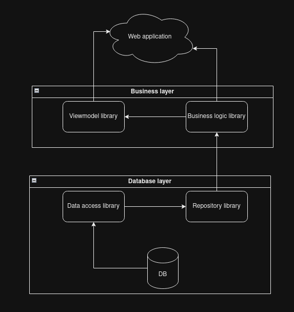
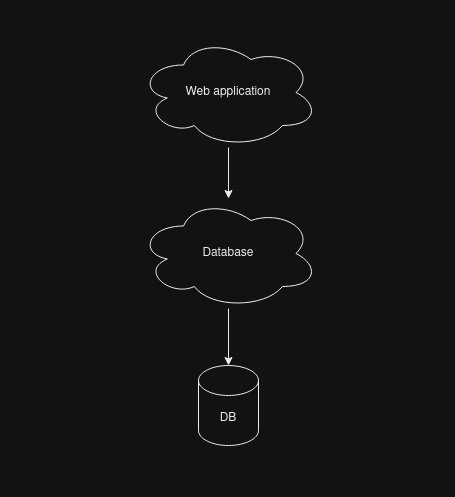

# phalanx
Template of an ASP.NET solution that relies on PostgREST instead of a bunch of classes and projects for a N-Layer structure.

A typical N-Layer application in .NET (or dotnet, it doesn't really matter) is something like this:

I know, I know, I oversimplified the structure, but at its core there are just 3 main layers:

- Application: The part which the users interacts, here is where the UI/UX live, it can have minor to none business logic.
- Business: The part in which has the rules, validations, data transformations and everythin related to how the application should behaive from the information perspective.
- Database: Also called Data access layer, is the section that have all the database related stuff to connect, execute queries and database statements.

In my experience, there isn't a single N-layer application simplier than this one as I show you. In really instead of 5-10 elements (projects or libraries), there are more than 20, in most cases even more than 100, but at the end of the day, all of them can be reduced to any of those 3 mentioned layers.

## My Problem

I'm more than clear that having so many projects is not a problem, is organization. I just don't like it. I feel that navigating around 20+ files just to understand how an insert/update works it's just annoying, specially when I need to maintaining legacy code for a project that in idle loads more than 1 GB of RAM, is a nigthmare to debug and optimize it,... Sorry for the rant. My point is that you 100% don't need to use this repository.

I'm trying to fix a problem that I have with my own personal projects that grow too fast, too large, give me headaches and depression every time that I need to boilerplate 20+ classes/projects just for a new method or debug an existing one.

The other problem that I have (yes, is more than only one), is related to the performance of the application which is directly related with the structure of the projects. Every new object for every new class needs to be instantiated, that's the base of OOP and having so many classes represents a new block of memory that needs to be managed for every request for every user. I understand that the DRY-ness, DDD-ness, TDD-ness and all the other may look like a good religion but in reality we're just creating a technical debt that is directly proportional to the performance of the application. It's just faster for any company to create a new version of the same application using newer tech stack than optimize the existing one. EVERY.SINGLE.TIME. Why? because investing 1-3 years in creating a new version is faster than optimizing the old one to appeal to the newer users and newer graphical interfaces designs concepts.

Some companies have in mind to use the latest tech stack just to have a longer and maintenable single source code, but in less than 10 years they repeat themself at least twice, having 2 or more source codes to debug. As a developer we don't need to just use the latest tech stack, we need to master it and for that, at least is my opion, we shouldn't create such a complex structures just to be demolish every 3 to 5 years. 

I want and I need to work in creating a prymid, an egyptian pyramid that may take me my whole life but will last a century or two before someone or something decide to demolish it.

## My Solution

Again, I know that I over simplified the structure.

I will keep everything dead simple. Database PostreSQL. Database first. Will use a PostgREST to connect to the database and which also will expose the neccessary endpoints for all my tables/views/funcions/storedprocedures/etc. 

All the complex queries will be optimized will be optimized on the database, not in a middleware. The application can be as simple as just consume the API, doesn't needs to be ASP.NET, I'll use it just because I have certain level of selfhatred or just for screamming YOLO and F U to all other web developers.

### Why PostgREST

I'll don't need to create the same class twice or more for every entity, one for the table in my database and one for the core structure of the CRUD that will be used by the application.

By exposing endpoints almost immediately, the application can be almost anything, not only web.

F*ck Entity Framework and EF Identity in general. EF is good and all, but having an application that dictates the structure of the database is not how things works in reality. If I'm working as a software developer, I should consume the database and my software should use what my database tells me I can do. If I'm working as a DBA, I should create the rules, roles, permissions and queries required for any application according to my company's policy. That responsability shouldn't be to a developer nor to an application.

Even if I want to rollback and just use EF instead of PostgREST and I know that can be done, I'll need to replicate almost everything that PostgREST already implements for me just for a flavor as a developer and I'll coming back to my problem.

## Goals

- Create a simple table
- Create a simple form for insert/update
- Implement soft-delete
- Implement JWT authentication, the issuer must be the ASP.NET Application
- TBA